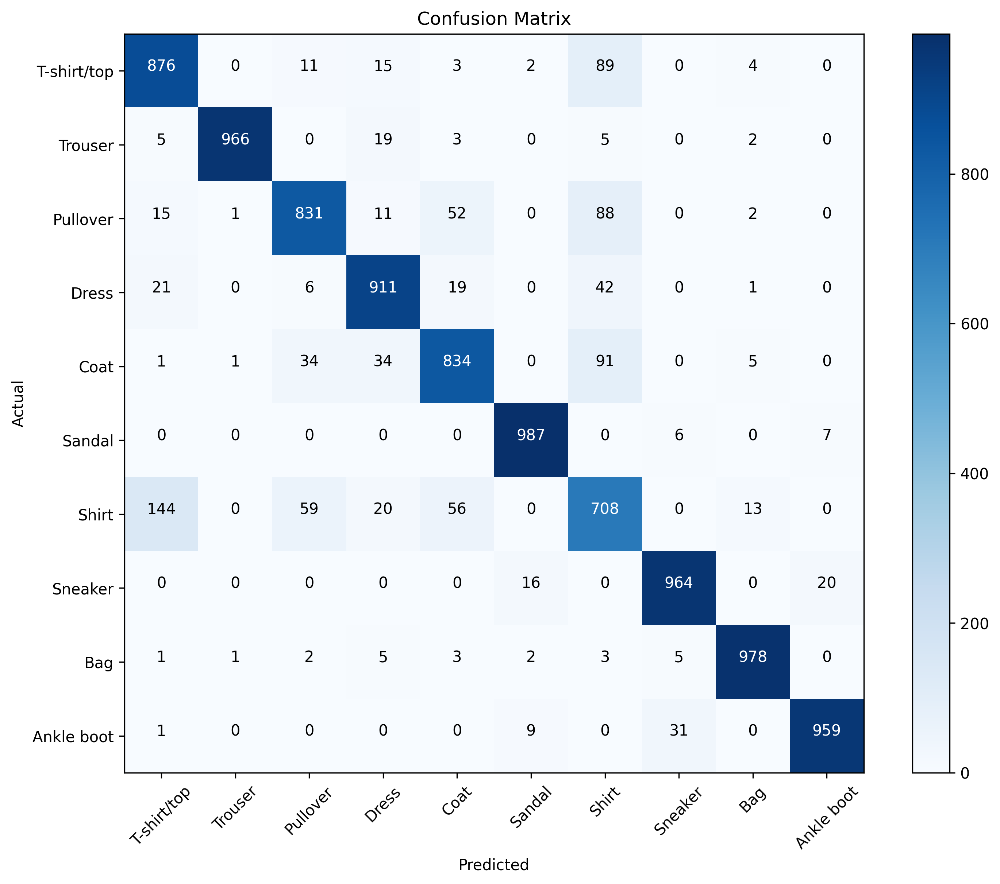

# Convolutional Neural Network Model

## Description 
This is a CNN Model to classify grayscale images of clothing into 10 clothing categories using the 70,000 images in the Fashion MNIST Dataset to train and test the model. The model is implemented in Python, using Keras and TensorFlow. I tested different epochs and hyperparameters to achieve 90% accuracy.  

## Dataset
The clothing items included in the Fashion MNIST, and the categories we classify the images into are:
- T-shirt/top
- trouser
- pullover
- dress
- coat
- sandal
- shirt
- sneaker
- bag
- ankle boot

## Final Architecture
- Learning Rate: 0.001
- Number of Convolution Layers: 3
- Neurons in Final Dense Layer: 128
- Number of Epochs: 10
- Convolutional Layers:
  - Layer 1: 32 filters, (3×3) kernel, ReLU activation
  - Layer 2: 64 filters, (3×3) kernel, ReLU activation + MaxPooling (2×2)
  - Layer 3: 64 filters, (3×3) kernel, ReLU activation
- Pooling Method: MaxPooling2D with (2×2) pool size after first two convolutional blocks
- Dense Layers: One hidden layer with 128 neurons (ReLU) + Dropout (0.5) + Output layer (10 neurons, softmax)

## Training and Evaluation Metrics
### Epoch Experiment Results:
- 5 epochs: Test Accuracy = 0.8679
- 10 epochs: Test Accuracy = 0.8963
- 15 epochs: Test Accuracy = 0.9060
### Hyperparameter Experiment Results:
1. LR=0.001, Layers=3, Neurons=64: 0.8948
2. LR=0.005, Layers=3, Neurons=64: 0.8973
3. LR=0.001, Layers=4, Neurons=64: 0.8971
4. LR=0.001, Layers=3, Neurons=128: 0.9014 (BEST)
### Training Progress Analysis:
The training logs show consistent improvement across all experiments
- Training accuracy increased from ~64% to ~90% across 10-15 epochs
- Validation accuracy closely tracked training accuracy, indicating good generalization
- Loss decreased steadily from ~0.95 to ~0.25-0.30 range
- No significant overfitting observed

## Analysis
### Analysis of Best Model:
The best performing model used a learning rate of 0.001, 3 convolutional layers, and 128 neurons in the dense layer. This configuration achieved a final test accuracy of 90.14%, which is the highest among all experiments conducted. 
### Training and Evaluation Results Analysis:
The model achieved an overall test accuracy of 90.14%. When examining individual class performance, there are significant variations.
Classes with particularly low accuracy:
- Shirt: 70.8% accuracy (lowest performing class)
- Coat: 83.4% accuracy
- T-shirt/top: 87.6% accuracy
- Pullover: 83.1% accuracy
These four classes, all upper-body garments, show lower performance compared to other categories like Trouser (96.6%), Bag (97.8%), and Sandal (98.7%).
### Confusion Matrix Analysis:

#### Key observations:
- Trouser classification is nearly perfect with 966/1000 correct predictions
- Shirt is frequently misclassified as T-shirt/top (144 instances), Coat (91 instances), and Pullover (59 instances)
- Upper-body garments (Shirt, T-shirt/top, Pullover, Coat, Dress) form a cluster with significant cross-confusion
- Footwear categories show some confusion between Sandal, Sneaker, and Ankle boot
- Bag has excellent discrimination with minimal confusion with other classes

#### Key observations:
The bar graph visualization clearly shows Shirt as the lowest performing class (highlighted in red) with an F1-score of 0.6989, significantly below the average performance.
### Most Difficult Class Analysis:
The most difficult class to predict is Shirt, which has the lowest F1-score of 0.6989.
#### Why Shirt is challenging to predict:
1. Visual Similarity: Shirts share similar silhouettes and shapes with T-shirts/tops, pullovers, and coats
Feature Overlap: The collar details and sleeve styles that distinguish shirts from other upper-body garments are subtle and may be lost in the low-resolution 28x28 images
Category Ambiguity: The boundaries between casual shirts, formal shirts, and other upper-body garments can be blurry
Texture Limitations: Fabric textures that help humans distinguish shirt materials may not be clearly represented in the grayscale, low-resolution images
The confusion matrix confirms this analysis, showing that Shirt is most commonly confused with T-shirt/top (144 misclassifications), Coat (91 misclassifications), and Pullover (59 misclassifications), indicating that the model struggles to distinguish between these visually similar upper-body garment categories.
Limitations and Future Improvements
Current Model Limitations:
Accuracy Plateau: Final accuracy of 90.14% falls just short of the 90% target
Class Imbalance in Performance: Significant variance in performance across classes (Shirt vs Trouser)
Limited Architecture Complexity: Current model may be underfitting for this dataset but I was unable to make it more complex because my computer could not handle it and kept overheating
Potential Improvements:
Hyperparameter Optimization:
Systematic grid search for optimal parameters
Experiment with different optimizer algorithms

